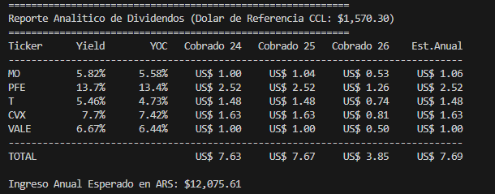

# 📈 Dividend Portfolio Tracker

ETL pipeline desarrollado en Python para analizar una cartera de CEDEARs mediante datos obtenidos desde la API de Invertir Online. El proyecto automatiza la extracción de cotizaciones, calcula métricas financieras, simula estrategias de inversión DCA con reinversión de dividendos y genera datasets listos para ser visualizados en Power BI.

## 🚀 ¿Qué hace este proyecto?

Automatiza el análisis de una cartera de CEDEARs siguiendo un flujo ETL completo.

El pipeline realiza las siguientes tareas:

- Obtiene cotizaciones en tiempo real desde la API de Invertir Online.
- Descarga el histórico de precios de cada activo.
- Registra dividendos históricos.
- Calcula métricas financieras del portfolio.
- Simula inversiones mediante Dollar Cost Averaging (DCA).
- Genera archivos CSV preparados para Power BI.

El objetivo es demostrar habilidades de Data Analytics, ETL, Python, Pandas y Power BI aplicadas a datos financieros reales.


## Ejecutar el programa
- cd Dividend-Portfolio-Traker
- py main.py

## Arquitectura
```text
                +----------------+
                | InvertirOnline |
                +-------+--------+
                        |
                 OAuth Authentication
                        |
                        ▼
                Python Data Collector
                        |
        +---------------+----------------+
        |                                |
        ▼                                ▼
   prices.csv                   historical.csv
        |                                |
        +---------------+----------------+
                        |
                Portfolio Analytics
                        |
                        ▼
                Investment Simulator
                        |
                        ▼
                 simulation.csv
                        |
                        ▼
                Power BI Dashboard
```
---
## 🛠 Tecnologías

- Python
- Requests
- Pandas
- Power BI
- Git
- GitHub
- API REST
- CSV


## 📁 Archivos generados
```text
|Archivo	                  |Descripción
|prices.csv	              |Cotizaciones actuales
|historical.csv	        |Histórico de precios
|dividends.csv	            |Dividendos históricos
|portfolio.csv	            |Configuración de la cartera
|portfolio_metrics.csv	    |Métricas calculadas
|simulation.csv	            |Resultado del simulador
```

## Pipeline
```
            API Invertir Online
                     │
                     ▼
            Extracción (Python)
                     │
                     ▼
          data/raw/
      ├── prices.csv
      ├── historical.csv
      └── dividends.csv
                     │
                     ▼
        Transformación (Pandas)
                     │
                     ▼
         data/processed/
      ├── portfolio.csv
      ├── simulation.csv
      └── portfolio_metrics.csv
                     │
                     ▼
             Power BI Dashboard
                     │
                     ▼
        KPIs • Dividendos • DCA
         Rendimiento • CAGR
```

---

## 📊 Métricas calculadas
El proyecto calcula automáticamente indicadores financieros como:

- Valor actual del portfolio
- Ganancia/Pérdida
- Rendimiento (%)
- Peso de cada activo
- Dividend Yield
- Yield on Cost (YOC)
- Dividendos cobrados por año
- Ingreso anual esperado
- Evolución del capital mediante DCA

## 📊 Funcionalidades

### ✔ Sprint 1 (Completado)
- Autenticación con API IOL
- Cotización en tiempo real
- Exportación a CSV

### ✔ Sprint 2 (Completado)
- Descarga de series históricas de cotizaciones
- Automatización y guardado de históricos

### ✔ Sprint 3 (Completado)
- **Pipeline ETL completo**: separación de datos en `raw/` y `processed/`
- **Métricas de Dividendos**: cálculo de Dividend Yield, Yield on Cost (YOC), ingreso anual proyectado y dividendos cobrados por año (2024, 2025, 2026) cruzando datos con `dividends.csv`.
- **Tipo de cambio dinámico**: consumo de la API de `dolarapi.com` para obtener el dólar CCL de referencia en tiempo real.
- **Simulador DCA con Reinversión**: simulación secuencial que incluye aportes, compras regulares, cobro de dividendos y reinversión para potenciar el interés compuesto.

### 🚧 Sprint 4 (Próximo)
- Dashboard interactivo en Power BI (KPIs, Gráficos históricos, Evolución de portafolio, DCA y Dividendos).

---

## 📌 CEDEARs analizados
- MO (Altria Group)
- PFE (Pfizer)
- T (AT&T)
- CVX (Chevron)
- VALE (Vale S.A.)

---

> [!NOTE]
> *Historical dividend data used for educational and analytical purposes.*

---

## Próximas mejoras
- Base de datos SQL
- Automatización diaria
- Dashboard web
- Análisis de riesgo